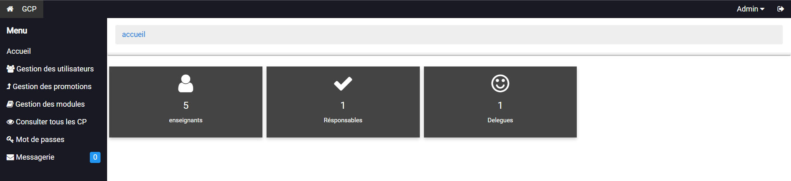
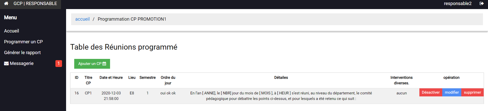
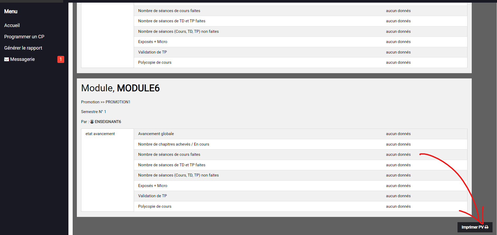

# EDUCATIONAL COMMITTEE MANAGEMENT SYSTEM
# Introduction
The project consists of studying, designing and creating a platform for managing the educational committees of
departments within the University of Guelma. It allows, on the one hand, for the administration to effectively manage
and control the members who play a role in carrying out various educational actions, setting meeting dates, sending
invitations, etc. On the other hand, it allows the actors (course leaders, teachers, and students) to follow the
educational activities within the department.
# Work plan
1. Analyse 
2. System design
3. Implementation
4. Testing
# Actors
there are four main actors interacting with this system:
- Administrator.
- Course Leaders.
- Teachers.
- Delegate.

so the overall architecture of this system is divided into four platforms for use.
# Project features
- Authentication
- Accounts management (CRUD operations)
- record of proceedings management
- chat system
- Courses and modules Management, as well as the assignment of modules and courses to teachers.
- Verbal process generation (pdf)
- Overall progress
- Progress of lectures
- Progress of tutorials
- Progress of practical work
...
# Use cases

# Database design

# Technologies
This project was built using the following technologies:

- **PHP**: The server-side scripting language used to build the - back-end of the system.
- **jQuery**: A JavaScript library used to simplify client-side scripting and add interactivity to the system.
- **MySQL**: A relational database management system used to store and manage data.
- **HTML**: Used to create the structure and layout of the system.
- **CSS**: Used to style and design the system.

## Tools
- **XAMPP**: A software package that includes Apache, MySQL, and PHP, used to develop and test the system locally.
- **Atom**: A text editor used to write and edit the code.
- **Astah UML**: A software used to create UML diagrams for the system design.

# Installation
1. Install XAMPP on your system.
2. Clone the repository or download the files to the htdocs folder
inside the XAMPP folder.
3. Start the Apache and MySQL modules in XAMPP.
4. Open your browser and go to http://localhost/phpmyadmin
5. Create a new database and import the database file provided in the repository.
6. Open the file config.php inside the includes folder and change the database connection details to match your setup.
7. Open your browser and go to http://localhost/{your-folder-name} to access the system.

# Usage
1. Log in to the system using the administrator account provided in the database file.
2. Add and manage users, courses, and committees.
3. Schedule meetings and send invitations.
4. View the progress of courses and committees.
Generate reports and procès-verbaux.

# Screenshots
Here are some screenshots of the system in action:

 The login page where users can enter their credentials.

 The dashboard where users can view an overview of the system's functionality.

 The committees management page where responsible can add, edit,view and print record of proceedings..

 Meeting available in active status to and form to be fulfilled 

YOUTUBE: https://youtu.be/mJLhP0dgNeo
